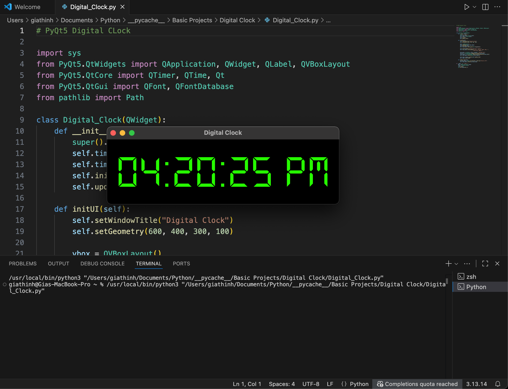

# Digital Clock

A simple digital clock application built with Python.

## Features

- Displays the current time
- Updates automatically every second
- Simple and clean interface

## Technologies

- Python
- PyQt5

## Screenshot



## How to Run

Clone this repository:

```bash
git clone https://github.com/your-username/Digital%20Clock.git
